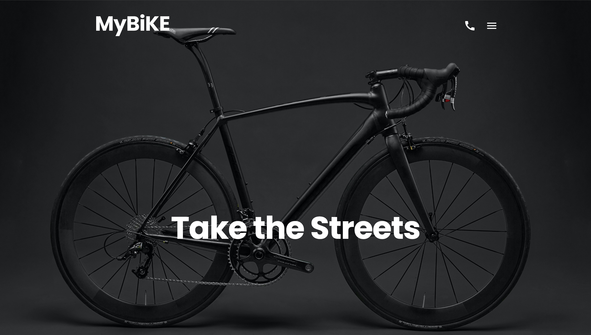
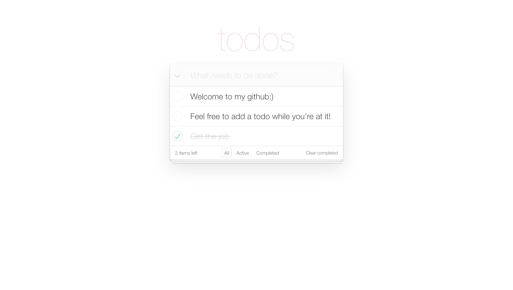
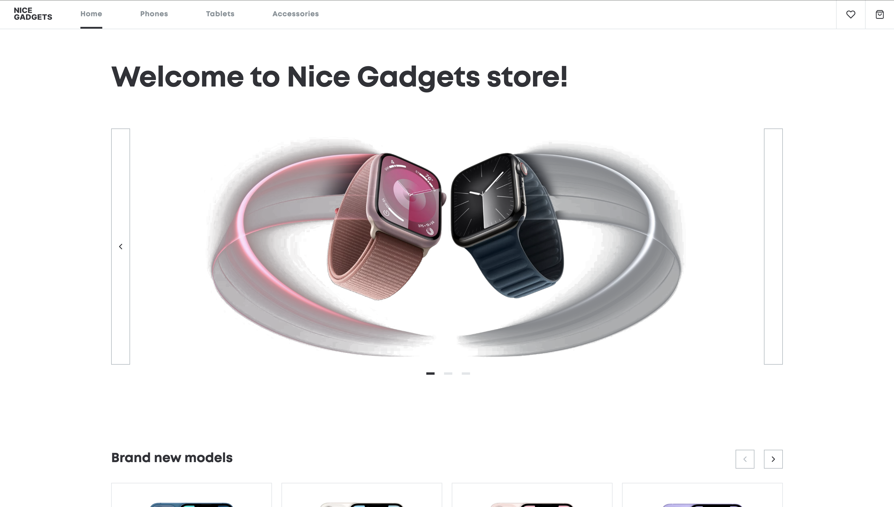

## <h1 style="text-align: center"> Hi there 👋 <a href="mailto:chuszno.dev@gmail.com">💬 Let's Connect!</a> </h1>

 

🎉 Welcome to my GitHub profile! 🎉

--- I'm a passionate Full-Stack Developer based in Poland with 2 years of learning with multiple front-end and back-end finished projects. Currently, I'm interning at Mate Academy where I design responsive web applications and write clean, maintainable code. ---

🔧 My Tech Stack:

🌍 I have advanced English proficiency (C1) and strong collaboration skills gained from working in diverse environments. I’m proven to adapt quickly, manage projects efficiently, and solve problems effectively.

🚀 I’m open for collaboration and work opportunities! 🚀

Let's create something amazing together! Feel free to reach out or connect with me on LinkedIn or drop me an email at chuszno.dev@gmail.com.

### **💻 My Projects **
<i>Name is for the repo, photo redirects to the demo</i>

| [MyBike](https://github.com/olafchuszno/layout_miami) | [ToDoApp](https://github.com/olafchuszno/react_todo-app-with-api) | [NiceGadgets](https://github.com/olafchuszno/react_phone-catalog) |
| ----------- | ----------- | ----------- |
|  |  |  |

<embed type="video/webm" src="[video.mp4](https://www.youtube.com/watch?v=snYu2JUqSWs&pp=ygUJMTBzIHZpZGVv)" width="400" height="300">

https://www.youtube.com/watch?v=snYu2JUqSWs&pp=ygUJMTBzIHZpZGVv

https://www.youtube.com/watch?v=snYu2JUqSWs&pp=ygUJMTBzIHZpZGVv

## **📜 My Stats**
 

 
<!--  -->

